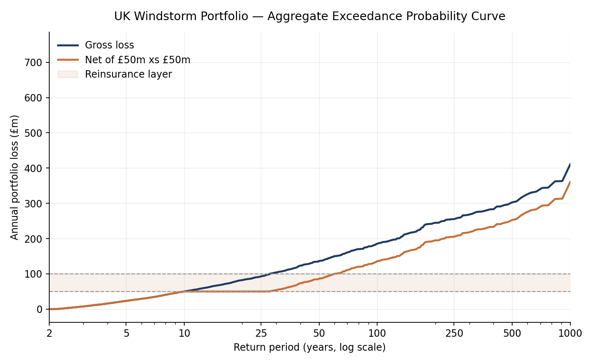

# UK Windstorm Catastrophe Model

A stochastic catastrophe model for a notional £6.65bn UK property insurance
portfolio, built to understand how catastrophe risk is quantified and how
reinsurance structures respond to the tail of a loss distribution.

Built in Python with the event catalogue and simulation output persisted to
SQLite.

---

## What it does

| Stage | File | Output |
|---|---|---|
| Stochastic event set | `build_event_set.py` | 2,500-event catalogue, 4.2 events/year, written to SQLite |
| Simulation & analysis | `run_model.py` | 10,000-year Monte Carlo, EP curves, reinsurance analysis |

**Portfolio:** £6.65bn total insured value across five UK regions, weighted so
that Scotland, Wales and northern England carry higher hazard multipliers than
the south east — North Atlantic extratropical cyclones track north and west.

---

## Method

**1. Stochastic event set.** 2,500 synthetic windstorms, each with a severity
index drawn from a lognormal distribution and an annual rate. Rates decline
with severity so that the catalogue reproduces a realistic frequency-severity
relationship: severe storms are rare, moderate storms are common. Catalogue
rates sum to 4.2 landfalling events per year.

**2. Vulnerability.** A saturating exponential damage function maps storm
intensity (severity × regional hazard) to a mean damage ratio, capped at 35%.
Windstorm damages roofs and cladding rather than destroying building stock, so
the ceiling matters — using an uncapped curve would materially overstate the
tail.

**3. Simulation.** 10,000 simulated years. Each year draws a Poisson number of
events, samples them from the catalogue in proportion to their rates, and
applies secondary uncertainty (realised damage varies lognormally around the
mean ratio). A 2% per-event deductible is retained by the insured.

**4. Exceedance probability.** Losses are ranked to produce both curves:
- **AEP** (aggregate) — total annual portfolio loss
- **OEP** (occurrence) — largest single event in the year

**5. Reinsurance.** A £50m excess of £50m aggregate layer is applied to the
simulated years to derive attachment and exhaustion probabilities, expected
loss to the layer, and the resulting reduction in the insurer's net tail.

---

## Results

**Average Annual Loss: £16.3m** — 24.6 bps of total insured value.

### Exceedance probability

| Return period | AEP (annual aggregate) | OEP (single event) |
|---:|---:|---:|
| 1-in-10 | £50.0m | £43.4m |
| 1-in-25 | £92.9m | £82.5m |
| 1-in-50 | £136.6m | £119.4m |
| **1-in-100** | **£185.5m** | **£165.6m** |
| 1-in-200 | £244.9m | £218.0m |
| 1-in-250 | £255.3m | £237.8m |

AEP sits roughly 12% above OEP at the 1-in-100 because years containing
multiple significant storms aggregate to more than any single event in them.
The gap narrows in the far tail, where one dominant storm accounts for most of
the annual loss.

### Reinsurance: £50m xs £50m

| | |
|---|---|
| Probability layer attaches | 9.99% — 1-in-10 years |
| Probability layer exhausts | 3.60% — 1-in-28 years |
| Expected loss to layer | £3.03m |
| Technical rate on line | 6.05% |
| Gross 1-in-100 | £185.5m |
| Net of layer 1-in-100 | £135.5m |
| **Tail reduction at 1-in-100** | **27.0%** |



The net curve is flat between the 1-in-10 and 1-in-28 points — the layer is
absorbing the whole increment — then runs parallel to gross, £50m below it,
once the limit is exhausted. Past that point the insurer is fully exposed
again, which is the argument for a second layer above £100m rather than a
wider first one.

---

## What the model shows

**The layer is efficiently placed but too thin.** It attaches at roughly the
1-in-10 year loss, so it earns its premium regularly, and a 6.05% technical
rate on line is reasonable for that attachment point. But it exhausts at
1-in-28, which means it does nothing for the genuinely bad years. The 27% tail
reduction at the 1-in-100 flatters the structure: at the 1-in-250 the insurer
retains £205m of a £255m loss.

**Capping the damage function matters more than the frequency assumption.**
Sensitivity testing showed the far tail is far more responsive to the
vulnerability ceiling than to the annual event rate. Frequency drives the
working layer; severity drives solvency.

**Aggregate and occurrence diverge most in the middle of the curve.** At low
return periods multiple small events accumulate; in the far tail a single
storm dominates. A reinsurance programme bought on an occurrence basis would
leave a gap exactly where the two curves are furthest apart.

---

## Technical notes

- Python (NumPy, pandas, matplotlib), SQLite for persistence
- Seeded RNG — results are reproducible
- SQL used to join the event catalogue to the exposure table and aggregate
  rates by region

```bash
python build_event_set.py   # builds catalogue, writes catmodel.db
python run_model.py         # runs simulation, writes ep_curve.png
```

---

## Limitations

This is a learning model built on plausible but illustrative parameters, not a
calibrated commercial one. In particular: the event set is synthetic rather
than derived from reanalysis data; there is no spatial correlation structure
between regions within an event, so a storm's footprint is simplified to a
single primary region; and the vulnerability curve is a functional form rather
than being fitted to claims data. A commercial model would address all three.
